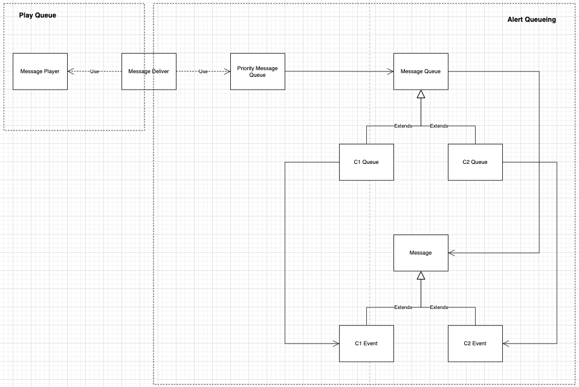

## 음성 알람 기능

기능 사용 방법은 index.ts를 참고

다음의 요구조건을 만족함

- 알람은 Category 1(이하 C1)과 Category 2(이하 C2)로 분류됨
- 알람이 재생 중일 때 다음 알람이 발생하는 경우 현재 알람이 재생 완료 된 후 idle 시간까지 대기한 후에 재생 됨
- C1 알람은 C2 알람 보다 우선순위가 높음 C2알람이 먼저 대기 중일 때 C1 알람이 발생하면 다음 재생 시점에서 C1 알람이 먼저 재생됨
- C1 알람은 모두 재생되어야 하지만 C2 알람은 동일한 타입의 알람이 3초 내에 발생한 경우에는 무시함
- C1, C2 알람 모두 대기 시간이 60초가 넘은 경우에는 재생되지 않고 버려짐

UML 구조

